# AGENTS.md
This file provides guidance to Verdent when working with code in this repository.

## Table of Contents
1. Commonly Used Commands
2. High-Level Architecture & Structure
3. Key Rules & Constraints
4. Development Hints

---

## Commonly Used Commands

```bash
# Development
npm run dev          # Start dev server (localhost:3000)
npm run build        # Build for production
npm run start        # Serve production build
npm run lint         # Run ESLint

# Testing [inferred - no test setup currently]
# npm test           # (Not configured yet)

# Database
# Execute supabase/schema.sql in Supabase SQL Editor
```

---

## High-Level Architecture & Structure

### Subsystems & Responsibilities

```mermaid
flowchart TB
    subgraph Frontend["Frontend (Next.js 14 App Router)"]
        Home[Home Page<br/>Categories + Hero]
        Search[Search Page<br/>Filter & Sort]
        Offer[Offer Detail<br/>Reserve/Contact]
        Vendor[Vendor Dashboard<br/>Branches & Offers]
        Admin[Admin Panel<br/>Approve Vendors]
    end
    
    subgraph Backend["Backend (Supabase)"]
        Auth[Auth + RLS]
        DB[(PostgreSQL<br/>RPC: search_offers)]
        Storage[Storage<br/>Offer Images]
    end
    
    subgraph Lib["Core Libraries (src/lib)"]
        AuthLib[auth.ts<br/>signIn/signUp/signOut]
        VendorLib[vendor.ts<br/>CRUD vendors/branches/offers]
        SearchLib[search.ts<br/>searchOffers RPC]
        GeoLib[geo.ts<br/>Haversine distance]
    end
    
    Home --> Search
    Search --> Offer
    Offer --> DB
    Vendor --> Auth
    Admin --> Auth
    
    Frontend --> Lib
    Lib --> Backend
    
    style Frontend fill:#1e293b
    style Backend fill:#0f172a
    style Lib fill:#1e1b4b
```



### Key Data Flows

1. **Public Search Flow:**
   - User enters query on `/search`
   - `searchOffers()` calls Supabase RPC `search_offers()`
   - RPC returns offers with vendor, branch, product, and distance data
   - Results sorted by price or distance (if geolocation enabled)

2. **Vendor Registration Flow:**
   - User signs up on `/vendor/login`
   - Creates vendor (business) profile
   - Creates branch (physical location with address)
   - Publishes offers (product + price + stock status)
   - Admin must approve vendor before offers appear publicly [inferred]

3. **Order/Reservation Flow:**
   - Buyer clicks "Reservar" on offer detail
   - Form: name + phone → creates order in DB
   - Redirects to `/order/success`
   - [No email notification implemented yet]

### External Dependencies

- **Supabase:** Auth, PostgreSQL (with RLS), Storage, RPC functions
- **Next.js 14:** App Router, Server Components, Image Optimization
- **Tailwind CSS:** Styling framework
- **Vercel:** Deployment platform (recommended)

### Development Entry Points

- `src/app/page.tsx` → Home (public)
- `src/app/search/page.tsx` → Search/Browse (public)
- `src/app/vendor/page.tsx` → Vendor Dashboard (auth required)
- `src/app/admin/page.tsx` → Admin Panel (admin role required)
- `src/lib/supabase.ts` → Supabase client configuration

---

## Key Rules & Constraints

### From README.md

1. **Environment Variables Required:**
   - `NEXT_PUBLIC_SUPABASE_URL`
   - `NEXT_PUBLIC_SUPABASE_ANON_KEY`
   - Must create `.env.local` (not tracked in git)

2. **Database Initialization:**
   - Run `supabase/schema.sql` in Supabase SQL Editor before first use
   - Schema includes RLS policies, RPC functions, seed data

3. **Authentication:**
   - Email/password only (no OAuth configured)
   - Vendors must authenticate to publish offers
   - Admins have special role via `admins` table

4. **Regional Focus:**
   - Target: Salta and Jujuy, Argentina
   - Prices in ARS (Argentine Pesos)
   - Distance calculated in kilometers

### Project-Specific Constraints

1. **RLS (Row Level Security) Active:**
   - `vendors`, `branches`, `offers` → write access only for owner or admin
   - `categories`, `products` → public read, admin write
   - `orders`, `order_items` → anyone can create (anonymous orders)
   - Always test with non-admin user to verify RLS

2. **Image Uploads:**
   - Stored in Supabase Storage bucket: `offer-images`
   - [No validation on file type/size currently - security risk]
   - Must configure `next.config.js` with Supabase hostname for `<Image>`

3. **Search RPC Function:**
   - `search_offers()` is the core search logic (PostgreSQL function)
   - Returns flat result set (no nested JSON)
   - Supports full-text search, category filter, distance sort
   - [Performance: no pagination implemented yet]

4. **Vendor Approval Workflow:**
   - New vendors start with `is_active = false`
   - Admin must manually set `is_active = true` in `/admin/vendors`
   - Only active vendors' offers appear in search results

5. **PWA Configuration:**
   - `public/manifest.json` defines app metadata
   - `public/sw.js` is basic service worker (network-first cache)
   - [No offline functionality implemented]

---

## Development Hints

### Adding a New Feature

1. **Add a new page:**
   - Create `src/app/[route]/page.tsx`
   - Export default component
   - Add metadata export for SEO

2. **Add a new API endpoint:**
   - [Currently no Next.js API routes - all backend is Supabase]
   - To add: Create `src/app/api/[route]/route.ts`
   - Use for server-side only logic (e.g., webhooks, rate limiting)

3. **Add a new Supabase table:**
   - Update `supabase/schema.sql` with DDL
   - Re-run in Supabase SQL Editor
   - Update `src/lib/database.types.ts` with TypeScript types
   - Add RLS policies (never skip this!)

4. **Add a new search filter:**
   - Modify `supabase/schema.sql` → `search_offers()` function
   - Update `src/lib/search.ts` → `searchOffers()` params
   - Update `src/app/search/page.tsx` → add UI control

### Modifying Authentication

- Auth logic in `src/lib/auth.ts`
- Uses `@supabase/supabase-js` client
- Session stored in cookies (handled by Supabase SDK)
- To add OAuth: Configure in Supabase Dashboard → Auth → Providers

### Extending Admin Panel

- All admin pages under `src/app/admin/`
- Check `is_admin()` function (Supabase RPC) for authorization
- Admin table: `admins` (references `auth.users.id`)
- To add admin: `INSERT INTO admins (user_id, email) VALUES (...)`

### CI/CD Pipeline

- [No CI/CD configured yet]
- Recommended: GitHub Actions for lint + build check on PR
- Vercel auto-deploys from `main` branch (if connected)

### Common Gotchas

1. **Supabase Client Initialization:**
   - Always use `src/lib/supabase.ts` singleton
   - Never instantiate `createClient()` directly in components

2. **TypeScript Errors:**
   - Run `npm run build` to catch type errors
   - `database.types.ts` must match Supabase schema exactly

3. **RLS Debugging:**
   - If mutation fails silently, check RLS policies
   - Use Supabase Dashboard → Table Editor → RLS tab
   - Test with `psql` or SQL Editor: `SELECT current_user, auth.uid()`

4. **Image URLs:**
   - Must add Supabase hostname to `next.config.js` → `images.remotePatterns`
   - Example: `udzgfeothpunfcipeqbh.supabase.co`

---

## Future Improvements (Out of Scope)

- [ ] Email notifications (Resend/SendGrid)
- [ ] Rate limiting (Upstash Redis)
- [ ] Geocoding API (Google Maps)
- [ ] Analytics dashboard (Vercel Analytics)
- [ ] SEO optimization (metadata, sitemap)
- [ ] Image validation (file type, size limits)
- [ ] Pagination for search results
- [ ] Unit/integration tests

---

*Last updated: 2026-02-12 by Verdent AI*
